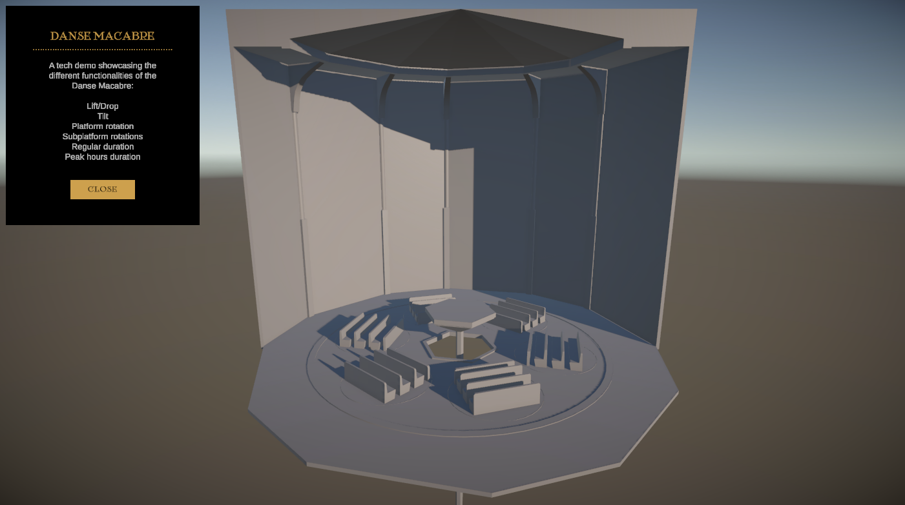

# Case 1: Danse Macabre Tech Demo
## Client: Efteling

## Table of contents
- [Example Screenshot](#example-screenshot)
- [Description](#description)
- [Features](#features)
- [Getting Started](#getting-started)
- [Credits](#credits)
- [License](#license) 

### Example Screenshot

    
### Description
Efteling is preparing to open its new attraction, Danse Macabre, a thrilling and mysterious ride where visitors are taken on a ghostly adventure aboard a large rotating platform. Before the real-life attraction is built, Efteling has developed a digital tech demo in Unity.

### Features
- The large central platform must rotate.
- The six smaller seat platforms must rotate independently.
- A lift mechanism must raise the entire platform while it continues to spin.
- A drop mechanism must make the platform suddenly fall while spinning.
- A tilt mechanism must allow the platform to tilt at an angle.

### Getting Started
#### Requirements
Unity 6000.0.35f1 or later, using the universal render pipeline (URP) version 7.2.1 or later.
Visual Studio 2022 Community Edtion.

### Credits
- [Efteling](https://www.efteling.com/nl) 

### License
The source code of this project and associated documentation is licensed under the [MIT licence](https://choosealicense.com/licenses/mit/).
